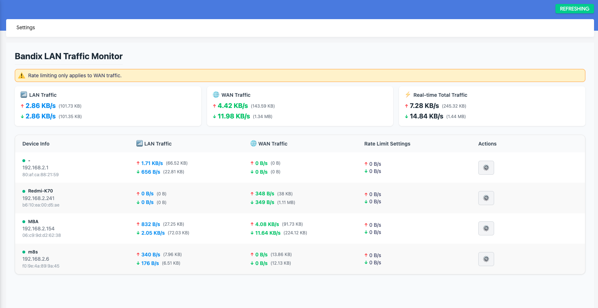

# LuCI Bandix

English | [简体中文](README.zh.md)

[](LICENSE)


LuCI Bandix is a network traffic monitoring application for OpenWrt, providing intuitive traffic data visualization and analysis through the LuCI web interface.

## Introduction

LuCI Bandix is developed based on the LuCI framework, offering network traffic monitoring capabilities for OpenWrt routers. This application depends on the openwrt-bandix backend service and helps users view and analyze network traffic statistics in real-time.





## Features

- Real-time network traffic monitoring
- Intuitive data visualization interface
- Seamless integration with OpenWrt system
- Automatically obtain the host name from DHCP/DNS (Static Leases)
- High-performance implementation based on Rust eBPF
- Support for LAN/WAN speed monitoring
- Support for WAN speed limitation

## Version Dependencies

The following table shows the version dependency relationship between luci-app-bandix and openwrt-bandix:

| luci-app-bandix version | Required openwrt-bandix version |
|------------------------|--------------------------------|
| 0.2.x                  | 0.2.x                          |
| 0.3.x                  | 0.3.x                          |

Please ensure you install matching versions to ensure compatibility and proper functionality.

## Installation

### Installation Steps

1. First install the openwrt-bandix backend

   Download the appropriate IPK package for your device from [openwrt-bandix Releases](https://github.com/timsaya/openwrt-bandix/releases), then install using opkg:

   ```bash
   opkg install bandix_latest_architecture.ipk
   ```

2. Install the luci-app-bandix frontend

   Download the IPK package from [luci-app-bandix Releases](https://github.com/timsaya/luci-app-bandix/releases), then install using opkg:

   ```bash
   opkg install luci-app-bandix_latest_all.ipk
   ```

3. Configure your LAN interface in settings

   After installation, go to the Bandix settings page and select your LAN interface to enable proper monitoring.

## Configuration

After installation, you can access the Bandix application through the LuCI web interface. The application is located under the "Network" menu.

## Maintainer

- [timsaya](https://github.com/timsaya)

## License

This project is licensed under the [Apache 2.0 License](LICENSE).

## Contributing

Issue reports and improvement suggestions are welcome! Please participate through GitHub Issues or Pull Requests. 